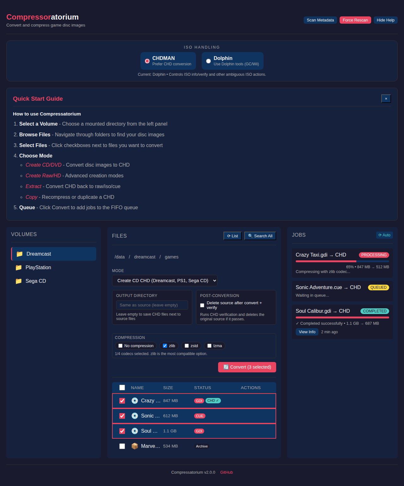
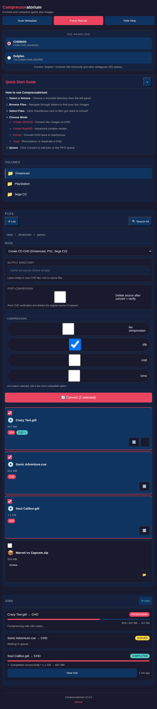
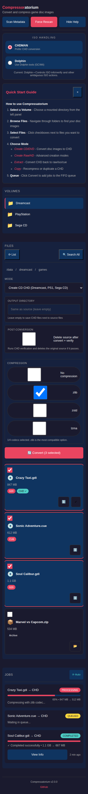

# Compressatorium

> **Fork Notice:** This project is a fork of MarcTV's original Docker CHD Converter project with an added Web UI and additional features. Thanks to [MarcTV](https://github.com/MarcTV) for the original CLI-based converter!

Multi-tool game disc image converter supporting **CHDMAN** (MAME), **dolphin-tool** (Dolphin Emulator), and **z3ds_compressor** (Nintendo 3DS).

## ✨ Features

* **🎮 Three Primary Tools:** Choose between CHDMAN, Dolphin, or 3DS compression
* **🌐 Web UI** for easy file browsing and conversion with intuitive tool selection
* **📁 Nested directories** and **compressed archives** (ZIP, 7z, RAR) support
* **💾 Multiple volume mounts** for organizing different game libraries
* **🔄 Smart file detection** - automatically identifies convertible files for each tool
* **✅ Existing output detection** with skip/rename/overwrite options
* **🗑️ Delete-on-verify** - optional automatic source removal after successful conversion
* **📊 Progress tracking** with real-time job queue monitoring
* **🔍 File information** - view metadata for CHD, Dolphin, and 3DS files

### Supported Conversions

| Tool | Input Formats | Output Formats | Use Case |
|------|--------------|----------------|----------|
| **CHDMAN** | .gdi, .cue, .bin, .iso | .chd | CD/DVD/LaserDisc to CHD |
| **Dolphin** | .iso, .gcm, .wbfs, .rvz, .wia, .gcz | .rvz, .wia, .gcz, .iso | GameCube/Wii disc images |
| **3DS** | .cci, .cia, .3ds | .zcci, .zcia, .z3ds | Nintendo 3DS ROM compression |

> **Archive inputs:** every input format above can be converted directly from inside a ZIP, 7z, or RAR archive — including 3DS ROMs and Dolphin disc images. Browse into the archive, pick a member, and convert. (CHDMAN extract/copy modes are the exception: they act on a finished `.chd`, which is an output, not a convertible source.)

### MAME Redump DAT Integration

Compressatorium supports one-click sync of [MAME Redump](https://github.com/MetalSlug/MAMERedump) DAT files (Logiqx XML format) to verify that your compressed files match known-good Redump hashes. This enables hash-based matching with tools like [Hasheous](https://github.com/gaseous-project/hasheous) and [RomM](https://github.com/rommapp/romm).

- **One-click sync**: Click "Sync from MAME Redump" in the DAT panel to download all ~69 DATs automatically from GitHub
- **Auto-sync**: Set `MAMEREDUMP_AUTO_SYNC=true` to sync DATs on container startup when none are loaded
- **CHD files**: Matched via header SHA1 (codec-independent, works with any compression setting on chdman 0.285)
- **RVZ files**: Matched via file-level SHA1 only when the RVZ bytes are identical to the DAT's recorded SHA1; RVZs produced by Dolphin may not be byte-identical to MAME Redump sets and may therefore not match
- **DAT management**: Import, list, and delete DATs via the web UI "DAT Files" button
- **Match badges**: Files matching a DAT entry show a blue "DAT" badge in the file list

---

## Installation

The Docker image is available from two registries:

### Docker Hub

```bash
docker pull pacnpal/compressatorium
```

### GitHub Container Registry

```bash
docker pull ghcr.io/pacnpal/compressatorium
```

Both registries provide identical images with multi-architecture support (`linux/amd64` and `linux/arm64`).

> **Note:** Use either registry: replace `pacnpal/compressatorium` with `ghcr.io/pacnpal/compressatorium` for the same image.

### Available Tags

| Tag | Description |
|-----|-------------|
| `latest` | Latest stable release |
| `beta` | Latest pre-release build (see warning below) |
| `X.Y.Z` | Specific stable version (e.g., `3.7.0`) |
| `X.Y.Z-beta-N` | Specific pre-release build (e.g., `3.7.0-beta-3`) |
| `sha-xxxxxxx` | Specific commit build |

### Opting in to beta updates

To track pre-release builds, pull the `:beta` tag instead of `:latest`:

```bash
docker pull pacnpal/compressatorium:beta
```

Or pin to a specific pre-release (recommended if you want to control when you upgrade):

```bash
docker pull pacnpal/compressatorium:3.7.0-beta-3
```

> **⚠️ Warning — beta builds can cause data loss.** Pre-releases may contain unfinished migrations, experimental conversion logic, or breaking changes to the job database. Running a beta against a database populated by a stable release can corrupt or irreversibly migrate it, and downgrading back to `:latest` afterwards is **not supported**. Before pulling `:beta`:
>
> - Back up your SQLite database (`compressatorium.db` in your data volume) and any in-flight output files.
> - Prefer a separate data volume for beta testing rather than pointing a beta container at your production volume.
> - Do not use beta builds for batches you cannot afford to redo.

---

## Quick Start Guide

### 1. Select Your Primary Tool

When you open the Web UI, you'll see three tool options at the top:

* **CHDMAN** - For converting CD/DVD/LaserDisc images to CHD format
* **Dolphin** - For GameCube/Wii disc image conversions
* **3DS** - For compressing Nintendo 3DS ROMs

**Choose the tool that matches your files.** The interface will automatically show only relevant modes and file types.

### 2. Browse and Select Files

* Navigate through your mounted volumes using the left panel
* Click on folders to browse subdirectories
* Check the boxes next to files you want to convert
* Archives (.zip, .7z, .rar) can be browsed by clicking them

### 3. Configure and Convert

* Select the appropriate conversion mode from the dropdown
* Adjust compression settings if available
* Click the action button (Create/Convert/Compress depending on mode)
* Monitor progress in the job queue panel

---

## Web UI Mode (Default)

The easiest way to use CHD Converter is through the web interface:

```bash
docker run -d \
  -p 8080:8080 \
  -e PUID=$(id -u) \
  -e PGID=$(id -g) \
  -v /path/to/config:/config \
  -v /path/to/games:/data/games \
  pacnpal/compressatorium
```

Then open **http://localhost:8080** in your browser.

> **Required:** The `/config` volume must be mounted for persistent data storage.  
> **Volume discovery:** If `COMPRESSATORIUM_VOLUMES` is unset, the app scans `/data/*` at startup and auto-registers mounted game volumes (restart after mount changes).  
> **Ownership (optional):** Set `PUID`/`PGID` to match your host user/group (for example Unraid `99:100`). If unset, defaults remain `999:999`.  
> **Default temp location:** `/config/temp`. To use a different location, set `CHD_TEMP_DIR` and mount it.

### Multiple Volumes

Mount multiple game directories for better organization:

```bash
docker run -d \
  -p 8080:8080 \
  -v /path/to/config:/config \
  -v /home/user/dreamcast:/data/dreamcast \
  -v /home/user/psp:/data/psp \
  -v /home/user/ps1:/data/ps1 \
  pacnpal/compressatorium
```

### Custom Output Directory

In the Web UI, you can specify a custom output directory for converted CHD, Dolphin, or 3DS outputs instead of placing them alongside the source files. The directory will be created automatically as long as it is within your configured volumes.

### Screenshots

The Web UI is fully responsive and works seamlessly on desktop, tablet, and mobile devices:

**Desktop View (1280px)**



**Tablet View (768px)**



**Mobile View (375px)**



The mobile interface features a card-based layout with touch-friendly controls (44-48px minimum touch targets), full-width inputs, and optimized spacing for better usability on small screens.

### Features

**File Browser**
- Navigate through mounted volumes and subdirectories
- View file sizes, types, ISO handling, and CHD status indicators
- Recursive search to find all convertible files across the entire volume

**Archive Support**
- Browse inside ZIP, 7z, and RAR archives without extraction
- Convert files directly from within archives
- Archives extract temporarily during conversion, then clean up automatically
- When a `.cue`/`.gdi` is present in the same archive folder, `.bin` entries are suppressed and batch jobs are deduplicated by output path to avoid stalled conversions.
- Archive listings include safety limits (max entries/size) and expose truncation metadata when limits are hit.
- **Any convertible source inside an archive can be converted** — CHDMAN (`.gdi`/`.iso`/`.cue`/`.bin`), Dolphin (`.iso`/`.gcz`/`.wia`/`.rvz`/`.wbfs`), and 3DS (`.cci`/`.cia`/`.3ds`). Archive members are surfaced for whichever tool accepts them, exactly like on-disk files.
- The only inputs that can't come from an archive are CHDMAN extract/copy modes, which operate on a finished `.chd` (an output, not a convertible source).

**ISO Handling & Dolphin Tools (GameCube/Wii)**
- Toggle ISO handling between CHDMAN and Dolphin (controls ISO info/verify and conversions)
- Convert `.iso`, `.gcz`, `.wia`, `.rvz`, `.wbfs` with dolphin-tool (RVZ/WIA/GCZ/ISO output)
- Disc info and verification for Dolphin formats (including batch verification)
- Dolphin sources may be converted directly from inside ZIP/7z/RAR archives (extracted to a temp dir for the conversion, then cleaned up)

**Batch Conversion**
- Select multiple files and convert them all at once
- Queue-based processing (FIFO), defaulting to serial execution (`MAX_CONCURRENT_JOBS=1`)
- Real-time progress tracking via Server-Sent Events
- Duplicate detection with options to skip, rename, or overwrite
- Optional delete-on-verify with a preflight confirmation list (includes `.cue`/`.gdi` track files)
- Archive conversions can delete the entire archive after verify (explicit warning in the delete plan)
- Job manager controls include **Cancel All** and **Clear Done**, both guarded by confirmation dialogs

**Bulk Operations**
- **Bulk Delete**: Delete multiple selected files at once
- **Bulk Verify**: Verify integrity of multiple CHD + Dolphin images simultaneously
- Smart categorization showing source files with/without CHD backups
- Warnings for files without verified CHD backups before deletion

**Verification**
- Verify CHD files using chdman's built-in verification
- Verify GameCube/Wii disc images using dolphin-tool (ISO uses Dolphin when ISO handling is set to Dolphin)
- Verification status persisted across sessions (stored in `/config/verified_chds.json`)
- Integrated verification workflow when deleting source files
- Visual indicators showing verified vs unverified items
- Optional timeouts for long-running verifications and stalled progress

**CHD Inspector**
- View detailed CHD file information (version, compression, size, hashes)
- SHA1 and Data SHA1 checksums displayed
- Raw chdman output available for advanced inspection
- Dolphin disc info shows game ID, region, format, compression, and raw output
- **Game ID & Title** — PS1, PS2, PSP, and Dreamcast game serials are extracted from CHD sector data (SYSTEM.CNF, PARAM.SFO, IP.BIN) and displayed in the info modal; human-readable titles are shown when available (e.g. "Patapon", "DEAD OR ALIVE 2")

**CHD Metadata Cache**
- Background metadata scan with CD/DVD badges
- **Retroactive game ID tagging** — scan embeds `GAME` and `NAME` metadata tags into existing CHDs that don't have them yet; future scans skip already-tagged files
- "Scan Metadata" and "Force Rescan" actions to refresh cached metadata
- Cache stored in `/config/chd_metadata.json`

**File Management**
- Rename files and directories
- Delete files with safety checks (warns about missing CHD backups)
- Empty directory cleanup

**Conversion Modes**
- **Create CHD**: createcd (CD), createdvd (DVD/PSP/PS2), createraw, createhd, createld
- **Extract from CHD**: extractcd, extractdvd, extractraw, extracthd, extractld
- **Copy/Recompress**: Recompress existing CHD files with different codecs
- **Dolphin (GameCube/Wii)**: dolphin_rvz, dolphin_wia, dolphin_gcz, dolphin_iso

**Compression Options**
- Choose from multiple compression codecs: zlib, zstd, lzma, huff, flac, avhu (A/V Huffman)
- CD-specific codecs: cdzl, cdzs, cdlz, cdfl (CD images only)
- No compression option for maximum compatibility (`-c none`)
- Select up to 4 codecs per conversion (CHD only)
- Dolphin modes accept one codec + optional level (RVZ/WIA), while GCZ/ISO ignore compression

---

## Dolphin Emulator Support (GameCube/Wii)

Dolphin support is available in the Web UI and REST API (CLI mode remains CHDMAN-only).

**Supported inputs:** `.iso`, `.gcz`, `.wia`, `.rvz`, `.wbfs`  
**Output modes:** `dolphin_rvz` (recommended), `dolphin_wia`, `dolphin_gcz`, `dolphin_iso`

**Notes**
- Requires the Docker image with Dolphin installed (default image includes `dolphin-emu` + wrapper).
- Dolphin conversions use `dolphin-tool` (configurable via `DOLPHIN_TOOL_PATH`).
- Compression is a single codec with an optional level (`zstd:5`, `bzip2:5`, `lzma:5`, `lzma2:5`).
- `dolphin_gcz` uses fixed compression and ignores codec selection.
- `dolphin_iso` outputs an uncompressed ISO image.
- Dolphin sources can be converted from inside ZIP/7z/RAR archives; the member is extracted to a temp dir for the conversion and cleaned up afterwards.
- ISO info/verify and conversions follow the ISO Handling toggle in the UI (no default - user must choose).

---

## Nintendo 3DS Support

3DS ROM compression is available in the Web UI and REST API using [z3ds_compress](https://github.com/energeticokay/z3ds_compress).

### How to Use

1. **Select Primary Tool:** Choose **3DS** from the three main options at the top of the Web UI
2. **Browse Files:** Navigate to your 3DS ROM directory
3. **Select ROMs:** Check the boxes next to `.cci`, `.cia`, or `.3ds` files you want to compress
4. **Compress:** Click the "Compress" button to start the conversion
5. **Monitor Progress:** Watch the job queue for real-time progress
6. **Done:** Compressed `.zcci`, `.zcia`, or `.z3ds` files will be created alongside the originals

### Supported File Formats

**Input Formats:**
- **`.cci`** - CCI (CTR Card Image) format - Nintendo 3DS cartridge dumps
- **`.cia`** - CIA (CTR Importable Archive) format - Installable packages, updates, DLC
- **`.3ds`** - Alternative extension for cartridge dumps (identical to .cci, can be renamed)

**Output Formats:**
- **`.zcci`** - Compressed CCI format (from .cci input)
- **`.zcia`** - Compressed CIA format (from .cia input)
- **`.z3ds`** - Compressed 3DS format (from .3ds input)

**Important Note:** The `.3ds` and `.cci` formats are functionally identical - they're both cartridge dump formats with different file extensions. You can freely rename between them. The z3ds_compress tool supports both extensions and maintains the naming convention (.3ds → .z3ds, .cci → .zcci).

### Technical Details

**Compression method:** Seekable ZStandard (256KB frame size)  
**Size reduction:** Typically **~50%** without compatibility issues  
**Compression speed:** Fast, single-threaded processing

**Compatibility:**
- Compressed ROMs are **natively supported** by [Azahar emulator](https://azahar-emu.org/) (release 2123+)
- Can be decompressed back to original format using the same tool if needed
- **`.cci` files:** Thoroughly tested and production-ready
- **`.cia` files:** Supported but considered experimental
- **`.3ds` files:** Same as .cci - fully supported (they're the same format)

**Technical Limitations:**
- z3ds_compressor binary is included in the Docker image (`Z3DS_COMPRESSOR_PATH=/usr/local/bin/z3ds_compressor`)
- Compression settings are fixed - no user configuration needed or available
- 3DS ROMs can be compressed directly from inside ZIP/7z/RAR archives (e.g. a `.zip` of `.3ds` files); the member is extracted to a temp dir for the conversion and cleaned up afterwards
- ROMs must be decrypted before compression (encrypted ROMs will not work)
- Progress tracking is based on output file size estimation
- Delete-on-verify is supported for automatic source file cleanup after successful compression

### Environment Variables

| Variable | Default | Description |
|----------|---------|-------------|
| `Z3DS_COMPRESSOR_PATH` | `/usr/local/bin/z3ds_compressor` | Path to z3ds_compressor binary |
| `MAMEREDUMP_REPO` | `MetalSlug/MAMERedump` | GitHub repo for DAT sync |
| `MAMEREDUMP_AUTO_SYNC` | `false` | Auto-sync DATs on startup if none loaded |
| `MAMEREDUMP_GITHUB_TOKEN` | *(unset)* | Optional GitHub PAT — raises API rate limit from 60 to 5 000 req/hr for DAT sync |

### REST API Endpoints

- `POST /api/jobs` or `POST /api/jobs/batch` - Queue 3DS compression jobs (use `mode: "z3ds_compress"`)
- `POST /api/dat/sync` - Sync all DATs from MAME Redump GitHub (one-click)
- `GET /api/dat/sync/status` - Check sync progress
- `POST /api/dat/sync/cancel` - Cancel an in-progress DAT sync
- `POST /api/dat/import` - Import a MAME Redump DAT file (multipart upload)
- `GET /api/dat/list` - List imported DATs
- `DELETE /api/dat/{dat_id}` - Delete an imported DAT
- `POST /api/dat/match` - Match a single file against DATs
- `POST /api/dat/match-batch` - Batch match files against DATs
- `GET /api/dat/stats` - DAT store statistics
- `GET /api/z3ds-info?path=/path/to/rom.cci` - Get file information (size, format, compression status)
- `GET /api/z3ds-verify?path=/path/to/rom.zcci` - Verify compressed 3DS output integrity
- `GET /api/z3ds-verify/events?path=/path/to/rom.zcci` - SSE stream for 3DS verify progress
- `POST /api/z3ds-verify-batch/events` - SSE stream for batch 3DS verification

---

## CLI Mode (Batch Processing)

For automated/headless conversion, use CLI mode. CLI mode runs CHDMAN only and processes
files in the **top level** of each mounted volume (no recursive scanning, no archives). See
`DOCKER-COMPOSE.md` for CLI behavior details.

### CD Conversion (Default)

```bash
docker run --rm \
  -e CHD_MODE=cli \
  -v "$(pwd)/isofiles:/data/games:rw" \
  pacnpal/compressatorium
```

### DVD Conversion (PSP, PS2)

```bash
docker run --rm \
  -e CHD_MODE=cli \
  -e CHDMAN_MODE=createdvd \
  -v "$(pwd)/isofiles:/data/games:rw" \
  pacnpal/compressatorium
```

### Multiple Volumes in CLI Mode

```bash
docker run --rm \
  -e CHD_MODE=cli \
  -e CHDMAN_MODE=createdvd \
  -v /home/user/psp:/data/psp:rw \
  -v /home/user/ps2:/data/ps2:rw \
  pacnpal/compressatorium
```

---

## Check Existing CHD Files

Using the chdman info command directly:

```bash
docker run --rm \
  -v "/path/to/games:/data/games:ro" \
  --entrypoint chdman \
  pacnpal/compressatorium \
  info -i "/data/games/game.chd"
```

Or use the Web UI's CHD Inspector feature by clicking on any `.chd` file.

---

## Compression Compatibility Tips

Some emulators (notably NetherSX2/AetherSX2) only support **zlib**-compressed CHDs. If you see
errors like “Failed to initialize cdvd,” re-convert with **zlib only**.

- **zlib**: best compatibility across emulators
- **zstd**: fast + small, but older software may not support it
- **lzma**: highest compression, slowest
- **No compression**: uses `-c none` for uncompressed output
- **CD-specific codecs**: use cdzl/cdzs/cdlz/cdfl for CD images only

For Dolphin formats, choose a single codec (zstd/bzip2/lzma/lzma2) and an optional level.
Use `chdman help createcd` or `chdman help createdvd` for codec details.

---

## Supported Operations

All actions are queued and processed by the job queue (FIFO). The queue is the only execution path.

**Create CHD**
- `createraw`, `createhd`, `createcd`, `createdvd`, `createld`

**Extract from CHD**
- `extractraw`, `extracthd`, `extractcd`, `extractdvd`, `extractld`

**Copy / Recompress**
- `copy` (CHD → CHD, optionally with new compression)

**Dolphin (GameCube/Wii)**
- `dolphin_rvz`, `dolphin_wia`, `dolphin_gcz`, `dolphin_iso`

**Nintendo 3DS**
- `z3ds_compress` (.cci → .zcci, .cia → .zcia, .3ds → .z3ds)

Notes:
- Compression applies to **create**/**copy** and Dolphin RVZ/WIA operations only.
- Extract operations ignore compression settings.
- `extractcd` produces both `.cue` and `.bin` outputs.
- Dolphin GCZ/ISO outputs ignore compression selection.
- 3DS compression uses fixed settings (no user configuration needed).
- Archive inputs are supported for CHD create modes only (not extract/copy/Dolphin/3DS).

---

## API Endpoints

The Web UI communicates with a REST API that can also be used directly. Interactive API documentation is available at `/docs` when running the container.

### File Operations

| Method | Endpoint | Description |
|--------|----------|-------------|
| GET | `/api/volumes` | List configured volume mount points |
| GET | `/api/files` | List files in a directory |
| GET | `/api/files/search` | Recursively search for convertible files |
| GET | `/api/files/archive` | List contents of an archive file |
| POST | `/api/files/rename` | Rename a file or directory |
| DELETE | `/api/files/delete` | Delete a single file or empty directory |
| POST | `/api/files/delete-batch` | Delete multiple files at once |

### Conversion Jobs

| Method | Endpoint | Description |
|--------|----------|-------------|
| POST | `/api/jobs` | Create a single conversion job |
| POST | `/api/jobs/batch` | Create multiple conversion jobs |
| POST | `/api/jobs/check-duplicates` | Check for existing output files |
| POST | `/api/jobs/delete-plan` | Build delete-on-verify confirmation list |
| GET | `/api/jobs` | List all jobs |
| GET | `/api/jobs/{id}` | Get a specific job |
| DELETE | `/api/jobs/{id}` | Cancel a job |
| DELETE | `/api/jobs/completed` | Clear completed/failed/cancelled jobs |
| POST | `/api/jobs/cancel-all` | Cancel all queued and processing jobs |
| GET | `/api/jobs/events` | SSE stream for job progress updates |
| GET | `/api/jobs/{id}/events` | SSE stream for a single job's progress |
| GET | `/api/jobs/stuck-status` | Check if job queue is in a stuck state |
| POST | `/api/jobs/recover` | Manually trigger recovery from stuck job queue |

**Destructive jobs actions require explicit confirmation headers:**
- `DELETE /api/jobs/completed` requires `X-CHD-Action-Confirm: clear-completed-jobs`
- `POST /api/jobs/cancel-all` requires `X-CHD-Action-Confirm: cancel-all-jobs`

### CHD Information & Verification

| Method | Endpoint | Description |
|--------|----------|-------------|
| GET | `/api/info` | Get CHD file metadata |
| GET | `/api/verify` | Verify a CHD file's integrity |
| GET | `/api/verify/events` | SSE stream for verification progress |
| POST | `/api/verify-batch/events` | SSE stream for batch verification |
| GET | `/api/verified` | List all verified CHD paths |

### CHD Metadata & Version

| Method | Endpoint | Description |
|--------|----------|-------------|
| GET | `/api/version` | Get app version |
| POST | `/api/chd-metadata` | Fetch cached CHD metadata for multiple files |
| POST | `/api/chd-metadata/scan` | Trigger background metadata scan |
| GET | `/api/chd-metadata/scan/status` | Check metadata scan status |

### Dolphin Disc Info & Verification

| Method | Endpoint | Description |
|--------|----------|-------------|
| GET | `/api/dolphin-info` | Get Dolphin disc metadata |
| GET | `/api/dolphin-verify` | Verify a disc image's integrity |
| GET | `/api/dolphin-verify/events` | SSE stream for Dolphin verification progress |
| POST | `/api/dolphin-verify-batch/events` | SSE stream for batch Dolphin verification |

## Environment Variables

| Variable | Default | Description |
|----------|---------|-------------|
| `CHD_MODE` | `webui` | Mode: `webui` (web interface) or `cli` (batch processing) |
| `COMPRESSATORIUM_MOUNT_ROOT` | `/data` | Startup scan root. When no explicit volumes are set, directories under this path (`/data/*`) are auto-registered |
| `COMPRESSATORIUM_VOLUMES` | (unset) | Explicit comma-separated volume paths. When set, startup scan is skipped |
| `CHD_MOUNT_ROOT` | `/data` | Legacy alias for `COMPRESSATORIUM_MOUNT_ROOT` |
| `CHD_VOLUMES` | (unset) | Legacy alias for `COMPRESSATORIUM_VOLUMES` |
| `PUID` | `999` | Optional runtime UID remap for `converter` before app startup (useful on Unraid/home servers) |
| `PGID` | `999` | Optional runtime GID remap for `converter`; if that GID already exists, `converter` is reassigned to the existing group |
| `CHD_DATA_DIR` | `/config` | Directory for persistent application data |
| `COMPRESSATORIUM_SEARCH_AUTO_RETURN_TO_FILE_LIST` | `true` | Web UI: when true, `Search All` conversions return to the previous file-list view after queueing |
| `CHD_SEARCH_AUTO_RETURN_TO_FILE_LIST` | `true` | Legacy alias for `COMPRESSATORIUM_SEARCH_AUTO_RETURN_TO_FILE_LIST` |
| `CHD_TEMP_DIR` | `/config/temp` | Temporary working directory for archive extraction (auto-created) |
| `CHD_CONCURRENCY_LOCK_DIR` | `/tmp/chd-locks` | Directory for job lock files (ephemeral, auto-cleaned on container restart) |
| `COMPRESSATORIUM_DB_PATH` | `/config/compressatorium.db` | Unified SQLite database for DATs, match cache, CHD metadata, verification state, and DAT-sync state |
| `CHD_METADATA_STORE` | *(deprecated)* | Legacy JSON path. Ignored at runtime; auto-migrated into the SQLite DB on first startup (custom path honored if set) and renamed to `chd_metadata.json.migrated.bak` |
| `CHD_VERIFICATION_STORE` | *(deprecated)* | Legacy JSON path. Ignored at runtime; auto-migrated into the SQLite DB on first startup (custom path honored if set) and renamed to `verified_chds.json.migrated.bak` |
| `CHDMAN_MODE` | `createcd` | Conversion mode: `createcd` or `createdvd` (CLI mode only) |
| `CHDMAN_PATH` | `/usr/bin/chdman` | Path to chdman binary (for custom builds) |
| `DOLPHIN_TOOL_PATH` | `/usr/local/bin/dolphin-tool` | Path to dolphin-tool binary |
| `Z3DS_COMPRESSOR_PATH` | `/usr/local/bin/z3ds_compressor` | Path to z3ds_compressor binary |
| `MAX_CONCURRENT_JOBS` | `1` | Maximum parallel conversion jobs (`1` = serial queue processing) |
| `MAX_QUEUE_DEPTH` | `0` | Max queued+processing conversion jobs before create endpoints return `429` (0 disables) |
| `MAX_VERIFY_CONCURRENCY` | `1` | Maximum concurrent verify workloads across CHD/Dolphin/3DS verify endpoints |
| `MAX_METADATA_SCAN_CONCURRENCY` | `1` | Maximum concurrent metadata scan tasks |
| `MAX_MATCH_CONCURRENCY` | `1` | Maximum concurrent DAT hash-matching operations. Raise only if your storage can handle parallel full-file reads (matching a raw Wii ISO is a full-file SHA1). |
| `MATCH_MAX_FILE_SIZE` | `0` | Skip DAT hash-matching for files larger than this many bytes (0 disables the cap). Set e.g. `2147483648` on slow storage to keep 8 GB ISOs from blocking the browse-triggered matcher. |
| `MAX_JOB_HISTORY` | `500` | Maximum completed jobs to retain in history |
| `CHD_CHDMAN_NICE` | `10` | Nice level for chdman (0-19, higher = lower priority) |
| `CHD_CHDMAN_IOPRIO_CLASS` | `2` | I/O priority class (`1` realtime, `2` best-effort, `3` idle) |
| `CHD_CHDMAN_IOPRIO_LEVEL` | `6` | I/O priority level (`0` highest, `7` lowest) |
| `CHD_ARCHIVE_MAX_ENTRIES` | `5000` | Max archive members to list (0 disables limit) |
| `CHD_ARCHIVE_MAX_MEMBER_SIZE` | `0` | Max size in bytes per archive member (0 disables limit) |
| `CHD_ARCHIVE_MAX_TOTAL_SIZE` | `0` | Max total size in bytes for archive listings/extractions (0 disables limit) |
| `CHD_INFO_TIMEOUT` | `60` | Timeout in seconds for `chdman info` (0 disables) |
| `CHD_VERIFY_TIMEOUT` | `0` | Timeout in seconds for `chdman verify` (0 disables) |
| `CHD_VERIFY_PROGRESS_TIMEOUT` | `0` | Timeout in seconds without verify output (0 disables) |
| `LOGLEVEL` | `INFO` | Log verbosity level (`DEBUG`, `INFO`, `WARNING`, `ERROR`, `CRITICAL`) |
| `LOG_PATH` | (none) | Path to log file (logs to stdout only if unset) |
| `LOG_COLOR` | `always` | ANSI-color stdout logs by level. Values: `always` (default — colored `docker logs` out of the box), `auto` (TTY + no `NO_COLOR`), `never`. File logs are never colored. |
| `CHD_DEBUG_HEARTBEAT` | `30` | Maintenance loop interval in seconds |
| `CHD_DEBUG_PROGRESS_INTERVAL` | `30` | Debug progress log interval in seconds |
| `CHD_DEBUG_PROGRESS_TIMEOUT` | `300` | Debug progress timeout in seconds |
| `CHD_PROGRESS_TIMEOUT` | `600` | Fail a conversion if progress and output size do not advance for this many seconds (0 disables) |
| `CHD_PROGRESS_TIMEOUT_PER_GIB` | `120` | Additional stall timeout seconds per GiB of input size |
| `CHD_PROGRESS_TIMEOUT_CAP` | `7200` | Upper bound for adaptive conversion stall timeout (0 disables cap) |
| `STATIC_DIR` | `/static` | Path to static web assets |

Defaults are intentionally conservative to reduce host impact during conversion. Increase `MAX_CONCURRENT_JOBS` or adjust `CHD_CHDMAN_*` only if your host has ample CPU/RAM and fast storage. By default temp files go to `/config/temp`; set `CHD_TEMP_DIR` to use a faster disk and mount it into the container.

---

## Persistent Data

The `/config` volume is **required** and must be mounted for the application to store persistent data.

```bash
-v /path/to/config:/config
```

### Data Files

| File | Location | Description |
|------|----------|-------------|
| `compressatorium.db` | `/config/` | SQLite database holding DAT index, hash match cache, CHD metadata cache, verification records, and DAT-sync state. Override path with `COMPRESSATORIUM_DB_PATH`. |
| `*.json.migrated.bak` | `/config/` | Legacy JSON stores, preserved as read-only backups after the one-time SQLite migration on first upgrade. Safe to delete once you've confirmed the app is working. |

#### First-run migration from JSON

On first startup after upgrading from a JSON-backed install, the app automatically imports `dat_store.json`, `verified_chds.json`, `chd_metadata.json`, and `dat_sync.json` into the new SQLite database. The originals are renamed to `<name>.migrated.bak` — **never deleted** — so you can always roll back. Migration is transactional, idempotent, and validates row counts; a failed or corrupt file is quarantined (`.corrupt` suffix) without blocking the other stores. These migration guarantees are described above in this section.

#### Schema changes (for developers)

Schema is managed by [Alembic](https://alembic.sqlalchemy.org/). On every startup:

1. If the DB already has an `alembic_version` row, Alembic runs `upgrade head`.
2. If the DB has the baseline tables but no `alembic_version` (pre-Alembic install), Alembic stamps the baseline revision (`0001`) and then runs `upgrade head` if later migrations are present. Alembic will create the `alembic_version` table as part of this process.
3. If the DB is empty, Alembic initializes it by applying the migration chain up to `head`.

To evolve the schema:

```bash
scripts/new_migration.sh "add foo column to dats"
# review migrations/versions/NNNN_*.py
# commit the new migration alongside your ORM changes
```

The test `test_no_model_drift_after_upgrade` fails if `Base.metadata` drifts from the migration chain — it runs on every test run and catches forgotten migrations.

### Ephemeral Runtime Data

The application also uses a non-persistent directory for runtime lock files:

| File / Directory | Location | Description |
|------------------|----------|-------------|
| `locks/` | `/tmp/chd-locks` | Job lock files (ephemeral, stored outside `/config` and automatically cleaned on container restart) |

---

## Docker Compose

The repository includes ready-to-use Docker Compose configurations:

- **`docker-compose.yml`** - Single volume setup with subdirectory support
- **`docker-compose.multi-volume.yml`** - Multiple separate volume mounts
- **`docker-compose.cli.yml`** - CLI/batch processing mode

### Quick Start

1. **Single Volume Setup** (recommended for most users):
   - Mount a top-level directory containing your games in subdirectories
   - The Web UI will recursively browse all subdirectories
   
```bash
docker-compose up -d
```

The default compose files include conservative CPU/memory limits to help avoid host lockups during large conversions. Adjust those limits to match your system.

### Tuning and Host Recommendations

**How to change settings**
- **Docker Compose:** edit `docker-compose.yml` (or `docker-compose.multi-volume.yml`) and update `MAX_CONCURRENT_JOBS`, `CHD_CHDMAN_*`, and the `deploy.resources` limits.
- **Docker run / Unraid:** set environment variables in the container template and apply CPU/memory limits there.

**Recommended starting points**
- **Low/medium hosts (≤16 GB RAM, HDD or parity-backed arrays):** keep `MAX_CONCURRENT_JOBS=1`, `CHD_CHDMAN_NICE=10`, `CHD_CHDMAN_IOPRIO_CLASS=2`, `CHD_CHDMAN_IOPRIO_LEVEL=6`. Set a container memory limit (8–12 GB).
- **Faster hosts (32+ GB RAM, SSD cache):** try `MAX_CONCURRENT_JOBS=2` and a higher memory limit (16–24 GB). Raise I/O priority only if the host remains responsive.
- **If the host becomes sluggish:** lower `MAX_CONCURRENT_JOBS`, increase `CHD_CHDMAN_NICE`, or set `CHD_CHDMAN_IOPRIO_CLASS=3` (idle) with `CHD_CHDMAN_IOPRIO_LEVEL=7`.

**Docker host tips**
- Prefer SSD/cache for `CHD_TEMP_DIR` and CHD output to reduce array contention.
- Avoid running other heavy services during conversion.
- Always set container CPU/memory limits on shared hosts.

2. **Multiple Volumes:**
```bash
docker-compose -f docker-compose.multi-volume.yml up -d
```

3. **CLI Batch Processing:**
```bash
docker-compose -f docker-compose.cli.yml up
```

### Example Configuration

```yaml
version: '3.8'

services:
  compressatorium:
    image: pacnpal/compressatorium
    ports:
      - "8080:8080"
    environment:
      - COMPRESSATORIUM_MOUNT_ROOT=/data
      - PUID=99
      - PGID=100
      - MAX_CONCURRENT_JOBS=1
      - CHD_CHDMAN_NICE=10
      - CHD_CHDMAN_IOPRIO_CLASS=2
      - CHD_CHDMAN_IOPRIO_LEVEL=6
    volumes:
      - /home/user/compressatorium-config:/config
      - /home/user/games/dreamcast:/data/dreamcast
      - /home/user/games/psp:/data/psp
      - /home/user/games/ps1:/data/ps1
    restart: unless-stopped
```

For production deployment guidance, see [DEPLOYMENT.md](DEPLOYMENT.md).

---

## Supported File Types

**Input formats:**
- `.gdi` - GD-ROM (Dreamcast)
- `.iso` - ISO 9660 disc images (CHD or Dolphin based on ISO handling)
- `.cue` / `.bin` - CD images with cue sheets
- `.gcz`, `.wia`, `.rvz`, `.wbfs` - GameCube/Wii disc images (Dolphin)
- `.cci`, `.cia`, `.3ds` - Nintendo 3DS ROM images (3DS compression)

**Archive formats (Web UI):**
- `.zip` - ZIP archives
- `.7z` - 7-Zip archives
- `.rar` - RAR archives

**Output formats:**
- `.chd` - Compressed Hunks of Data (MAME/CHDMAN)
- `.rvz`, `.wia`, `.gcz`, `.iso` - Dolphin output formats
- `.zcci`, `.zcia`, `.z3ds` - Compressed Nintendo 3DS ROMs

---

## Frontend Development

The Web UI is a **Svelte 5 + Vite** single-page app. Source lives under `src/`, the build pipeline emits `index.html` plus hashed assets into `static/`, and FastAPI serves the result via the existing `/static` mount and root `FileResponse`. Source code follows the architecture documented in `DESIGN_tool_plugin_architecture.md` §3.7 — a declarative tool registry (`src/lib/tools/registry.js`) drives every tool-specific decision so adding a new converter is one entry in `TOOLS`, no `if (tool === ...)` branches anywhere.

### Quick start

```bash
# Install JS deps (one-time)
npm install

# In one shell: start the FastAPI backend
./run_dev.sh                          # or: uvicorn app.main:app --port 8080

# In a second shell: start Vite with HMR
npm run dev                           # → http://localhost:5173
```

Vite proxies `/api` and `/health` to `http://localhost:8080`, so the dev server runs the SPA against the live backend with hot reload.

### Build & lint

```bash
npm run build       # Vite production build → static/index.html + static/assets/*
npm run preview     # Serve the built bundle locally on :4173
npm run lint        # ESLint (JS + .svelte) — flat config in eslint.config.js
```

### Architecture at a glance

* `src/App.svelte` — root shell: sidebar + topbar + routed view, error boundary, focus management on route change, skip-to-content link, mounts `<ModeWatcher />` (theme) and `<Toaster />` (notifications).
* `src/lib/stores/*.svelte.js` — class-singleton stores with Svelte 5 `$state` fields, one per feature domain (jobs / fileBrowser / conversion / verification / datMatching / chdMetadata / ui).
* `src/lib/api/` — REST client + auto-reconnecting EventSource (`sse.js`) + POST-body SSE stream parser for batch verify (`sseFetch.js`). Backend snapshot-on-connect (`/api/jobs/events`) hydrates the full job state; no separate REST round-trip needed.
* `src/lib/tools/registry.js` — every tool fact (id, label, hint, verify URL segment, source/verify exts, modes, groups, default mode, glyph, accent, **compression codecs / style / level range**, API bindings). Adding a 4th tool: one new entry + the backend plugin. Helpers like `registry.allFilterableExts()` keep UI surfaces (file-list filter dropdown, conversion mode dropdown, compression picker, etc.) automatically extended.
* `src/lib/components/panels/` — `VolumeList`, `Breadcrumb`, `FileList`, `FileRow`, `RowActionsMenu` (file browser); `ModeSelect`, `CompressionPicker`, `ConvertPanel` (conversion config); `JobRow`, `JobsPanel` (queue / completed / failed tabs with global Cancel-all / Clear / stuck-state recovery).
* `src/lib/components/modals/` — `BaseModal` (bits-ui Dialog wrapper), `ConfirmModal` (canonical confirm/cancel), then `BulkVerifyModal`, `DuplicateModal`, `DeleteModal`, `BulkDeleteModal`, `RenameModal`, `CHDInfoModal`, `CancelAllJobsModal`, `ClearDoneModal`. Each mounts in `App.svelte` and self-renders against a `ui` store target.
* `src/lib/components/dashboard/` — `StatCard` wrapper + `QueueSummaryCard`, `VolumeOverviewCard`, `RecentConversionsCard`, `VerificationStatusCard`, `QuickToolsCard`. QuickToolsCard iterates `registry.all()` — adding a tool auto-adds a tile.
* `src/styles/tokens.css` — semantic design tokens keyed by `:root` (light defaults) and `:root.dark` (dark overrides). No hex colors live outside this file.

### Runtime dependencies

* [`@lucide/svelte`](https://lucide.dev) — official Lucide icon library for Svelte 5 runes, tree-shakeable per icon.
* [`bits-ui`](https://bits-ui.com) — headless accessibility primitives (Dialog, DropdownMenu, ContextMenu, Tooltip, etc.). Used incrementally as panels need them; per-component import keeps bundle costs minimal.
* [`svelte-sonner`](https://svelte-sonner.vercel.app) — toast notifications. Call `toast.success(...)` / `toast.error(...)` / `toast.promise(...)` from anywhere; the `<Toaster />` in `App.svelte` is the surface.
* [`mode-watcher`](https://mode-watcher.sveco.dev) — light/dark/system mode management with localStorage persistence, system-preference tracking, and cross-tab sync. Applies `.dark` class to `<html>`; a matching inline script in `index.html` prevents FOUC on first paint.

### Docker / CI

The multi-stage `Dockerfile` has a dedicated `frontend-builder` stage that runs `npm ci && npm run build` inside `node:lts-slim`, then copies the output into the Python runtime image. The runtime image has no Node; `node:lts-slim` ships `linux/amd64` + `linux/arm64` so the existing multi-arch buildx pipeline keeps working unchanged.

---

## Acknowledgments

This project is a fork of the original Docker CHD Converter project by [MarcTV](https://github.com/MarcTV). The original project provides a simple CLI-based batch converter, and this fork extends it with a Web UI and additional features.

**Original Project:**
- Author: [MarcTV](https://github.com/MarcTV)

**Additional Tools:**
- [z3ds_compress](https://github.com/energeticokay/z3ds_compress) by [energeticokay](https://github.com/energeticokay) - Nintendo 3DS ROM compression

Thank you MarcTV and energeticokay for creating and sharing these tools!
